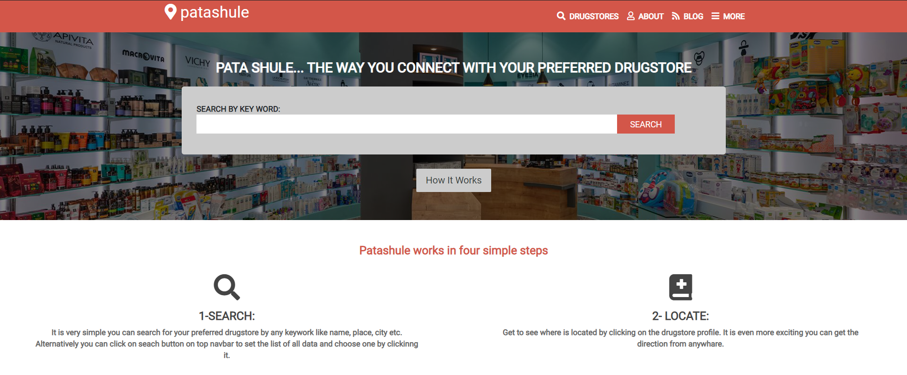

# Patashule

 

HTML &amp; CSS capstone project, created by following patachule design such as layout, fonts and styles. 

## Built With

- Html.
- CSS.
- Bootstrap.
- Font Awsome for icons.

## Live Demo

[Live Demo Link](https://mrigorir.github.io/patashule/)

## Author

👤 **Marco Parra**

- GitHub: [@mrigorir](https://github.com/mrigorir)
- Twitter: [@marcoparra311](https://twitter.com/marcoparra311)
- LinkedIn: [Marco Parra](https://www.linkedin.com/in/marco-parra-leal-a93318101/)
- email: (marcoparra311@gmail.com)

## 🤝 Contributing

Contributions, issues, and feature requests are welcome!

Feel free to check the [issues page](issues/).

## Show your support

Give a ⭐️ if you like this project!

## Acknowledgments

- Thanks for this Website Design [PATASHULE](https://www.behance.net/gallery/25563385/PatashuleKE).

## 📝 License

This project is [MIT](https://opensource.org/licenses/MIT) licensed.
